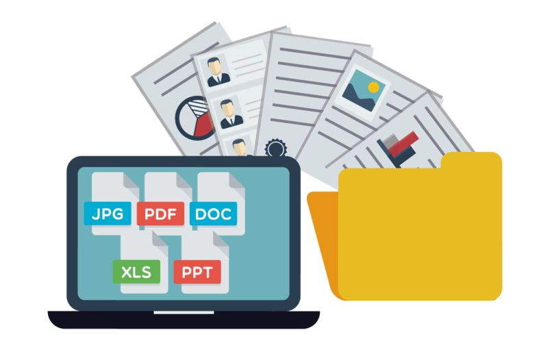

# Trabajo de Grado: Desarrollo de aplicación Web - Sistema de Gestión Documental para Instituciones Públicas

## Descripción

Este repositorio contiene el código fuente y la documentación del Trabajo de Grado "Desarrollo de aplicación Web - Sistema de Gestión Documental para Instituciones Públicas". El proyecto ha sido desarrollado por los siguientes integrantes:

- Christian Idrobo
- Jhonny Cortés
- Christian Felipe Martínez

## Visión del Proyecto

El objetivo principal de este proyecto es implementar una aplicación web de sistema de gestión documental para instituciones públicas. La aplicación permitirá a las instituciones gestionar su documentación, formatos, plantillas institucionales y demás recursos, centralizando todo en un único sistema. Algunas características destacadas del proyecto incluyen:

- Gestión de documentos: Permite cargar, almacenar y organizar documentos de forma segura y eficiente.
- Control de acceso: Establece roles y permisos para los usuarios, asegurando que solo tengan acceso a la información y acciones correspondientes a su función.
- Auditoría de documentos: Registra y realiza un seguimiento de las actividades relacionadas con la manipulación y acceso a los documentos, garantizando la trazabilidad y seguridad.
- Colaboración y flujo de trabajo: Facilita la colaboración entre diferentes áreas de la institución, permitiendo el intercambio y revisión de documentos de manera eficiente.
- Personalización: Permite adaptar la aplicación a las necesidades y requerimientos específicos de cada institución pública.

El objetivo final es mejorar la eficiencia en la gestión documental de las instituciones públicas, optimizando los procesos y garantizando un adecuado control y seguridad en la manipulación de los documentos.

## Licencia

Este proyecto se encuentra bajo la Licencia MIT.

